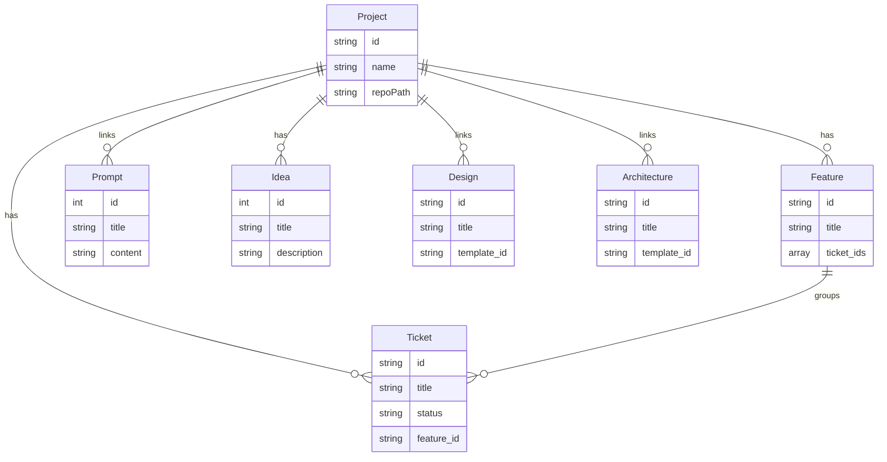

# Backend — KWCode

**Version**: 1.0  
**Last Updated**: 2026-02-15

---

## Tech Stack

- **Runtime**: Next.js server (Node) + optional Tauri v2 (Rust) for desktop
- **API**: Next.js Route Handlers in `src/app/api/` — REST-style only (no tRPC, no GraphQL)
- **Database**: SQLite (`data/app.db`) via `rusqlite` (Tauri); browser mode uses same API reading/writing files
- **File I/O**: `data/` (JSON) + `.cursor/` (markdown, JSON); `fs` and `path` on server
- **Validation**: Zod (`lib/api-validation.ts`) at API edge
- **External**: OpenAI API (server-side only) for generation routes

---

## Entities (Data Model)

| Entity      | Description              | Key Fields / Storage |
|-------------|--------------------------|------------------------|
| Ticket      | Work item / task         | id, title, description, status, priority, feature_id; SQLite + `.cursor/7. planner/tickets.md` |
| Feature     | Milestone grouping tickets | id, title, description, status, ticket_ids; SQLite + `.cursor/7. planner/features.md` |
| Prompt      | Reusable prompt template | id, title, content; SQLite |
| Design      | Design configuration    | id, title, sections, template_id; SQLite |
| Architecture| Architecture document    | id, title, template_id, sections; SQLite |
| Project     | Managed project          | id, name, repoPath, promptIds, ticketIds, ideaIds, designIds, architectureIds; SQLite + `data/projects.json` |
| Idea        | AI-generated idea        | id, title, description; SQLite |
| Run         | Run state (in-memory)    | Zustand store only; not persisted in DB |

**TypeScript types:** `src/types/ticket.ts`, `src/types/project.ts`, `src/types/design.ts`, `src/types/architecture.ts`, `src/types/prompt.ts`, `src/types/idea.ts`, `src/types/run.ts`

---

## API Routes (Overview)

```
src/app/api/
├── data/
│   ├── route.ts, projects/, prompts/, designs/, architectures/, ideas/, files/
│   ├── cursor-init-template/   # .cursor_inti template for Initialize
│   └── ...
├── check-openai/
├── generate-design/, generate-architectures/, generate-ideas/
├── generate-prompt/, generate-prompt-from-kanban/, generate-ticket-from-prompt/
└── ...
```

**Tauri (Rust):** `src-tauri/src/lib.rs` — commands for run, shell, file ops, git info, DB; `src-tauri/src/db.rs` — SQLite module.

---

## Data Layer (File System)

```
data/
├── app.db                # SQLite (primary storage)
├── projects.json         # Project definitions (optional sync)
├── tickets.json, features.json, prompts-export.json
├── designs.json, architectures.json, ideas.json
└── seed/
```

`.cursor/` in each project repo: `7. planner/tickets.md`, `7. planner/features.md`, `7. planner/kanban-state.json`, `setup/*.md`, `agents/*.md`, `prompts/*.md`.

---

## DB Schema (Logical / ER)


