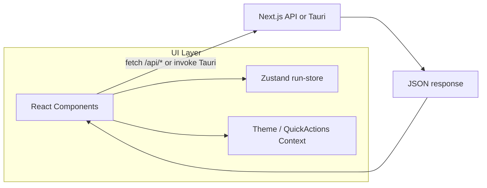

# Frontend — KWCode

**Version**: 1.0  
**Last Updated**: 2026-02-15

---

## Tech Stack

- **Framework**: Next.js 16 (App Router) on Node
- **UI**: React 18 with Client Components (`"use client"`); Server Components for root layout and simple page shells
- **Components**: shadcn/ui (Radix primitives), Tailwind CSS
- **State**: Zustand (`run-store.ts`) for run orchestration; React Context for theme (`ui-theme.tsx`) and quick actions (`quick-actions-context.tsx`); local component state elsewhere
- **Data fetching**: `fetch()` to `/api/*`; no React Query/SWR; no Server Actions
- **Shell**: Optional Tauri v2 desktop webview (same React app)

---

## Key Entities (Frontend)

| Entity    | Purpose                    | TypeScript Type           |
|-----------|----------------------------|---------------------------|
| Project   | Managed project directory  | `src/types/project.ts`    |
| Ticket    | Work item / task           | `src/types/ticket.ts`     |
| Run       | Run orchestration state    | `src/types/run.ts` (Zustand) |
| Prompt    | Prompt record              | `src/types/prompt.ts`     |
| Design    | Design configuration      | `src/types/design.ts`     |
| Architecture | Architecture document   | `src/types/architecture.ts` |
| Idea      | AI-generated idea          | `src/types/idea.ts`       |

---

## Component Hierarchy

```
src/components/
├── ui/          → shadcn/ui primitives (don't modify)
├── atoms/       → Small reusable pieces (buttons, badges, inputs)
├── molecules/   → Composed components (tabs, forms, Kanban, cards)
├── organisms/   → Page-level content (XxxPageContent.tsx)
├── shared/      → Cross-cutting (DisplayPrimitives, Dialog, GridContainer)
└── utilities/   → Utility components
```

---

## Data Flow (Frontend)



---

## Pages / Routes

| Page           | Organism                      | Route            |
|----------------|-------------------------------|------------------|
| Home           | HomePageContent               | `/`              |
| Project Detail | ProjectDetailsPageContent     | `/projects/[id]` |
| Run            | RunPageContent                | `/run`           |
| Prompts        | PromptRecordsPageContent      | `/prompts`       |
| Design         | DesignPageContent             | `/design`        |
| Architecture   | ArchitecturePageContent       | `/architecture`  |
| Ideas          | IdeasPageContent              | `/ideas`         |
| Testing        | TestingPageContent            | `/testing`       |
| Configuration  | ConfigurationPageContent      | `/configuration` |
