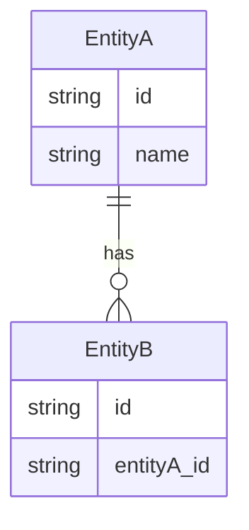

# Backend — [Project Name]

**Version**: 1.0  
**Last Updated**: (fill in)

---

## Tech Stack

List runtime, API style, database, and external services.

- **Runtime**: e.g. Node, Deno, Tauri (Rust), etc.
- **API**: e.g. REST, GraphQL, tRPC; framework (Next.js API, Express, etc.)
- **Database**: e.g. SQLite, PostgreSQL, MongoDB; ORM if any
- **File I/O**: e.g. `data/`, `.cursor/`, cloud storage
- **Validation**: e.g. Zod, Yup
- **External**: e.g. OpenAI, auth provider, email

---

## Entities (Data Model)

List main entities, tables, or collections and their key fields.

| Entity   | Description              | Key Fields / Storage     |
|----------|--------------------------|---------------------------|
| (entity) | (short description)       | id, name, ...             |

**TypeScript/ORM types:** e.g. `src/types/*.ts` or Prisma schema path.

---

## API Routes / Endpoints (optional)

Outline or link to API structure.

```
src/app/api/   (or your API root)
├── data/      → CRUD, file ops
├── generate/  → AI or other generators
└── ...
```

---

## Data Layer (optional)

Where persistent data lives (DB, files, cache).

```
data/
├── app.db or your DB file
├── *.json or config files
└── ...
```

---

## DB Schema / ER Diagram (optional)

Optional: Mermaid ER or schema diagram.


