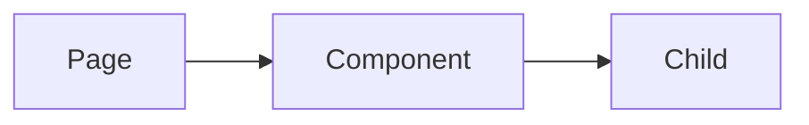

# Frontend — [Project Name]

**Version**: 1.0  
**Last Updated**: (fill in)

---

## Tech Stack

List frameworks, UI libraries, and build tooling used on the frontend.

- **Framework**: e.g. Next.js, Remix, Vite + React, etc.
- **UI**: e.g. React, Vue; component library (shadcn, MUI, etc.); CSS (Tailwind, CSS modules, etc.)
- **State**: e.g. Zustand, Redux, React Query, Context, local state
- **Data fetching**: e.g. fetch, SWR, React Query, Server Components
- **Other**: PWA, desktop shell (Tauri, Electron), etc.

---

## Key Entities (Frontend)

List the main domain entities or types the UI deals with and where they are defined.

| Entity    | Purpose                    | Type / Location           |
|-----------|----------------------------|---------------------------|
| (entity)  | (short description)         | e.g. `src/types/foo.ts`   |

---

## Component Hierarchy (optional)

Describe or link to the UI structure (e.g. atomic design, feature folders).

```
src/components/   (or your equivalent)
├── ui/          → primitives
├── ...          → your structure
```

---

## Diagrams (optional)

Optional: add a Mermaid diagram for component tree, data flow, or page map.



---

## Pages / Routes (optional)

| Page     | Route / Component          |
|----------|----------------------------|
| (name)   | /path or ComponentName     |
